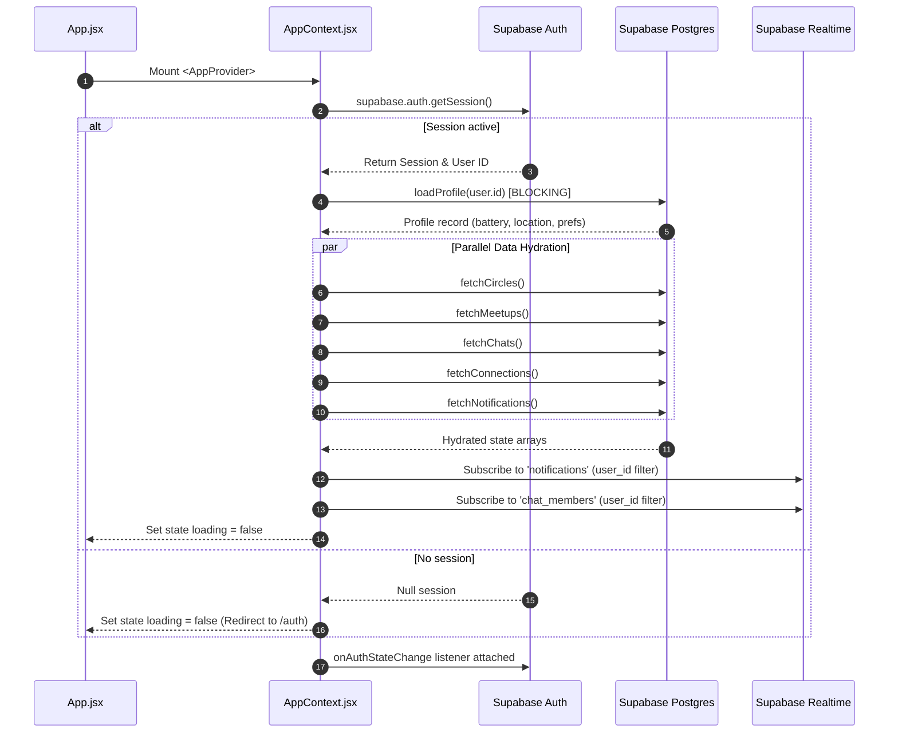
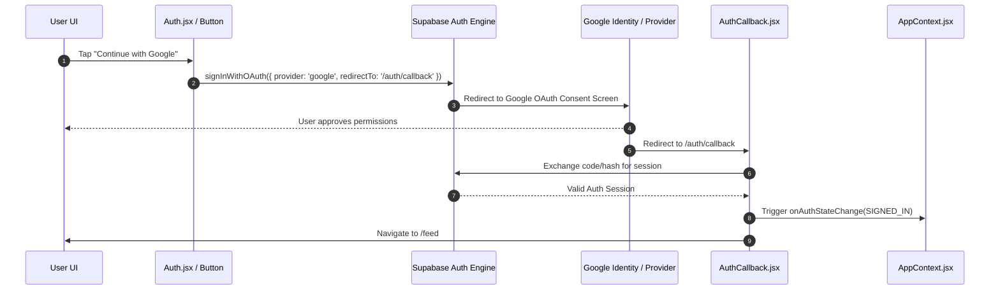

# System Architecture & Topology — Third Space

Technical reference covering the stack, deployment configuration, client boot sequence, state distribution, auth mechanisms, realtime pipelines, and native iOS integration.

---

## 1. Stack & Deployment Topology

Third Space is architected as a hybrid web/native social application coupled to a cloud-managed BaaS backend and deployed across dual Vercel projects.

```mermaid
flowchart TD
    subgraph Client Tier
        iOS[iOS App Container\nCapacitor 8 Shell] --> WebBundle[Vite React SPA\nsrc/]
        WebBrowser[Desktop / Mobile Web Browser] --> WebBundle
        AdminBrowser[Admin Web Browser] --> AdminBundle[Vite React Admin SPA\nadmin/src/]
    end

    subgraph Hosting Tier (Vercel)
        VercelMain[Vercel Project 1\nMain App Deployment] --> WebBundle
        VercelAdmin[Vercel Project 2\nAdmin Dashboard Deployment] --> AdminBundle
    end

    subgraph Backend Tier (Supabase Cloud)
        WebBundle --> Auth[Supabase Auth\nOAuth & JWT]
        WebBundle --> Postgres[(PostgreSQL Database\nRLS Enforced)]
        WebBundle --> Realtime[Supabase Realtime\nWebSocket Bus]
        WebBundle --> Storage[Supabase Storage\navatars & circle-covers]
        AdminBundle --> Postgres
        
        Postgres -- pg_net --> EF1[Edge Function\nsend-push]
        WebBundle --> EF2[Edge Function\ngoogle-calendar]
        EF1 --> APNs[Apple Push Notification Service]
        EF2 --> GCal[Google Calendar API]
    end
```

### Deployment Configuration

| Component | Repository Path | Hosting Target | Environment Variables |
| --- | --- | --- | --- |
| **Main App Client** | `src/` | Vercel (Project 1: `third-space`) | `VITE_SUPABASE_URL`, `VITE_SUPABASE_PUBLISHABLE_KEY` |
| **Admin Dashboard** | `admin/` | Vercel (Project 2: `third-space-admin`) | `VITE_SUPABASE_URL`, `VITE_SUPABASE_ANON_KEY` |
| **Database & Auth** | `supabase/migrations/` | Supabase Cloud (PostgreSQL 15+) | Managed by Supabase Vault & RLS |
| **Edge Functions** | `supabase/functions/` | Supabase Edge Runtime (Deno) | `APNS_TOPIC`, `APNS_KEY_ID`, `APNS_TEAM_ID`, `APNS_PRIVATE_KEY`, `GOOGLE_CLIENT_ID`, `GOOGLE_CLIENT_SECRET` |
| **iOS Native Shell** | `ios/` | iOS App Store (App Bundle `com.thirdspace.app`) | `capacitor.config.json` |

---

## 2. Application Boot Sequence (`AppContext.jsx`)

`src/context/AppContext.jsx` acts as the root orchestrator. When mounted inside `src/App.jsx`, it initializes authentication and loads application state in a controlled sequence.



### Detailed Step-by-Step Boot Order

1. **Mount**: `AppProvider` initializes state variables (`user`, `profile`, `circles`, `meetups`, `chats`, `connections`, `notifications`, `loading = true`).
2. **Auth Verification**: Invokes `supabase.auth.getSession()`.
3. **Profile Hydration (Blocking)**: If session exists, calls `src/lib/profiles.js:getProfile()`. If profile row does not exist, attempts auto-healing fallback insert before raising errors.
4. **Parallel Feature Hydration**: Once profile is verified, executes `Promise.all()` to hydrate non-dependent domain slices:
   - `src/lib/circles.js:listCircles()`
   - `src/lib/events.js:listUpcomingEvents()`
   - `src/lib/chat.js:listChats()` (uses `get_my_chat_summaries` RPC)
   - `src/lib/connections.js:listConnections()`
   - `src/lib/notifications.js:listNotifications()`
5. **Realtime Bus Initialization**: Attaches persistent PostgreSQL change subscriptions filtered by `auth.uid()` for incoming notifications and new chat memberships.
6. **State Ready**: Sets `loading = false`, rendering shell layout and active tab.

---

## 3. State Ownership & Architecture

Application state is partitioned between central context, custom domain hooks, and local component states.

```
AppContext (Global Contract)
├── Auth & Profile (user, profile, updateProfile, batteryPoints)
├── Social & Circles (circles, joinedCircles, joinCircle, leaveCircle, applyToCircle)
├── Meetups & RSVPs (meetups, myMeetups, rsvpEvent, cancelRsvp)
├── Chat Thread Summaries (chats, unreadCount, markChatRead)
├── Connection Graph (connections, connectUsers, disconnectUsers)
└── Notifications Feed (notifications, unreadNotifCount, markNotifRead)
```

| State Slice | Owner Module | Persistence Layer | Re-render Trigger |
| --- | --- | --- | --- |
| **Auth Session & User Profile** | `AppContext.jsx` | Supabase Auth + `profiles` table | Auth state change or profile edit |
| **Circles & RSVPs** | `AppContext.jsx` | `circles`, `circle_members`, `events`, `event_attendees` | Optimistic mutations + refetch |
| **Active Thread Messages** | `useChatMessages.js` hook | `messages` table | Supabase Realtime WebSocket (`INSERT` on `chat_id`) |
| **Game Session Board State** | `useGameState.js` hook | `games` table | Supabase Realtime WebSocket (`UPDATE` on `game_id`) |
| **Poll Voting State** | `usePoll.js` hook | `polls`, `poll_votes` tables | Supabase Realtime WebSocket (`INSERT`/`UPDATE` on `poll_id`) |
| **Assistant Conversation** | `src/lib/assistant/engine.js` | In-memory component state (`AssistantModal.jsx`) | User text entry or tool action |
| **Modal UI Visibility** | Local Components | Component state (`useState`) | User tap handlers |

---

## 4. Auth & OAuth Flow

Third Space supports traditional email/password authentication alongside Google OAuth.



### OAuth Callback Path
- OAuth redirects land on `src/pages/AuthCallback.jsx`.
- `AuthCallback.jsx` parses URL query/hash parameters, verifies token validity via `supabase.auth.getSession()`, updates `AppContext` state, and smoothly transitions to `/feed` without a full page refresh.
- If Google OAuth yields a new user, DB trigger `handle_new_user` (migration 24) automatically extracts `avatar_url`, `full_name`, and default preferences into a newly created `profiles` record.

---

## 5. Realtime Subscription Setup

Realtime synchronization relies on Supabase Realtime (Postgres Changes over WebSockets).

| Subscribed Table | Filter Expression | Handler Location | Component Action / Reaction |
| --- | --- | --- | --- |
| `notifications` | `user_id=eq.${user.id}` | `AppContext.jsx` | Invokes `fetchNotifications()`; increments `unreadNotifCount`. |
| `chat_members` | `user_id=eq.${user.id}` | `AppContext.jsx` | Invokes `fetchChats()`; updates chat list when added to new thread. |
| `messages` | `chat_id=eq.${chatId}` | `useChatMessages.js` | Appends message object to active chat thread array; updates last read timestamp if thread is open. |
| `games` | `id=eq.${gameId}` | `useGameState.js` | Updates board array, active turn indicator, and game status (`in_progress`, `completed`). |
| `polls` / `poll_votes` | `poll_id=eq.${pollId}` | `usePoll.js` | Recalculates vote percentages and active option counts. |

---

## 6. Native & Capacitor Integration Points (iOS Only)

Mobile deployment uses Capacitor 8 targeting iOS (`ios/App/App.xcodeproj`). There is no Android target.

```
ios/App/App/
├── AppDelegate.swift         # Native app lifecycle, Capacitor bridge init, APNs device token registration
├── Info.plist                # iOS permissions (Camera, Photo Library, Location, NSCalendarUsageDescription)
├── App.entitlements          # Push Notifications capability + Associated Domains (Deep links)
├── PrivacyInfo.xcprivacy     # Apple Privacy Manifest declaring API categories
└── capacitor.config.json     # App ID (com.thirdspace.app), app name, bundled web assets folder (public)
```

### Capacitor Native Plugins in Use
1. **Push Notifications (`@capacitor/push-notifications`)**:
   - Initialized in `src/lib/push.js`.
   - `AppDelegate.swift` captures native APNs token in `application(_:didRegisterForRemoteNotificationsWithDeviceToken:)` and passes it to Capacitor.
   - `src/lib/push.js` registers token with Supabase via `register_device_token` RPC into `device_tokens` table.
2. **Haptics (`@capacitor/haptics`)**:
   - Invoked on swipe discovery gestures (`SwipeDiscovery.jsx`), button taps, and game moves.
3. **Status Bar & Keyboard (`@capacitor/status-bar`, `@capacitor/keyboard`)**:
   - Controls status bar style (dark/light) and prevents iOS keyboard clipping on message composers.
