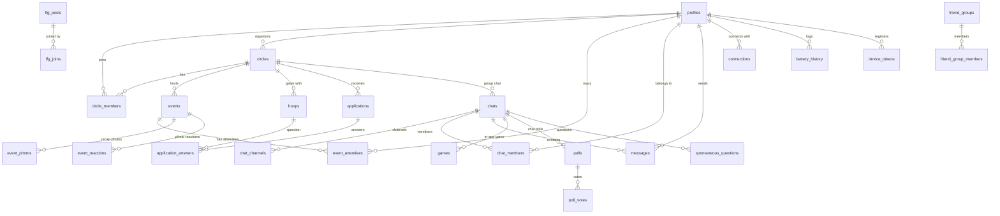

# Consolidated PostgreSQL Database Schema — Third Space

Live PostgreSQL schema reference for Third Space after folding all 59 database migrations (`00000000000001_initial_schema.sql` through `00000000000060_push_on_message.sql`).

---

## 1. Entity-Relationship Overview

---

## 2. Table-by-Table Schema Specification

### 1. `profiles`
User account profile data, location, battery score, and preferences. 1:1 with `auth.users`.
- **Introduced**: `00000000000001_initial_schema.sql` | **Last Modified**: `00000000000060_push_on_message.sql`

| Column | Type | Default | PK | FK | Constraints |
| --- | --- | --- | --- | --- | --- |
| `id` | `uuid` | `gen_random_uuid()` | YES | `auth.users(id)` ON DELETE CASCADE | NOT NULL |
| `display_name` | `text` | `''` | NO | None | NOT NULL |
| `avatar_url` | `text` | None | NO | None | Nullable |
| `bio` | `text` | `''` | NO | None | NOT NULL |
| `interests` | `text[]` | `'{}'` | NO | None | NOT NULL |
| `intents` | `text[]` | `'{}'` | NO | None | Introduced in m27 |
| `theme` | `text` | `'dark'` | NO | None | NOT NULL |
| `battery_points` | `integer` | `100` | NO | None | CHECK (0 <= battery_points <= 100) |
| `reconnect_threshold_days` | `integer` | `30` | NO | None | NOT NULL |
| `search_radius` | `integer` | `25` | NO | None | NOT NULL |
| `latitude` | `double precision` | None | NO | None | Introduced in m23 |
| `longitude` | `double precision` | None | NO | None | Introduced in m23 |
| `location_name` | `text` | None | NO | None | Introduced in m23 |
| `created_at` | `timestamptz` | `now()` | NO | None | NOT NULL |
| `updated_at` | `timestamptz` | `now()` | NO | None | NOT NULL |

- **Indexes**: Primary key index on `id`. Spatial query lookup on `(latitude, longitude)`.
- **Triggers**:
  - `trg_handle_new_user`: Executed `AFTER INSERT ON auth.users`. Runs `handle_new_user()` RPC to insert initial `profiles` row.
- **RLS Policies**:
  - `profiles_select`: `USING (true)` — Public authenticated read for all profiles.
  - `profiles_update_self`: `USING (auth.uid() = id) WITH CHECK (auth.uid() = id)` — Users can update only their own profile.
  - `profiles_insert_self`: `WITH CHECK (auth.uid() = id)` — Self insert allowed (m21).
- **Client Access Audit**: `location_name` is written by backend trigger during signup but never read directly in JS code (code reads lat/long or `display_name`).

---

### 2. `circles`
Interest-based communities created by users.
- **Introduced**: `00000000000001_initial_schema.sql` | **Last Modified**: `00000000000055_private_circle_visibility.sql`

| Column | Type | Default | PK | FK | Constraints |
| --- | --- | --- | --- | --- | --- |
| `id` | `uuid` | `gen_random_uuid()` | YES | None | NOT NULL |
| `organizer_id` | `uuid` | None | NO | `profiles(id)` ON DELETE CASCADE | NOT NULL |
| `name` | `text` | None | NO | None | NOT NULL |
| `description` | `text` | `''` | NO | None | NOT NULL |
| `type` | `text` | `'open'` | NO | None | CHECK (type IN ('open', 'private')) |
| `category` | `text` | `'General'` | NO | None | NOT NULL |
| `vibe` | `text` | `''` | NO | None | NOT NULL |
| `rules` | `text[]` | `'{}'` | NO | None | NOT NULL |
| `member_count` | `integer` | `1` | NO | None | NOT NULL |
| `cover_gradient` | `text` | `'from-indigo-500 to-purple-600'` | NO | None | NOT NULL |
| `cover_image_url` | `text` | None | NO | None | Introduced in m19 |
| `icon` | `text` | `'users'` | NO | None | Introduced in m51 |
| `applications_enabled` | `boolean` | `true` | NO | None | Introduced in m54 |
| `created_at` | `timestamptz` | `now()` | NO | None | NOT NULL |
| `updated_at` | `timestamptz` | `now()` | NO | None | NOT NULL |

- **Indexes**: PK index on `id`, index on `organizer_id`, index on `category`.
- **Triggers**: Auto-creates associated group chat on insert (`on_circle_created` trigger executing `sync_chat_members_with_circle_members`).
- **RLS Policies**:
  - `circles_select`: `USING (type = 'open' OR is_circle_member(id, auth.uid()) OR organizer_id = auth.uid())` — Open circles visible to all; private circles visible to members, organizer, or applicants (m55).
  - `circles_insert_organizer`: `WITH CHECK (auth.uid() = organizer_id)` — User must be set as organizer.
  - `circles_update_organizer`: `USING (auth.uid() = organizer_id)` — Organizer only.
  - `circles_delete_organizer`: `USING (auth.uid() = organizer_id)` — Organizer only.
- **Client Access Audit**: Fully read and written across `Circles.jsx`, `CircleDetail.jsx`, `Feed.jsx`.

---

### 3. `circle_members`
Junction table tracking circle memberships and roles.
- **Introduced**: `00000000000001_initial_schema.sql` | **Last Modified**: `00000000000013_tighten_circle_members_insert.sql`

| Column | Type | Default | PK | FK | Constraints |
| --- | --- | --- | --- | --- | --- |
| `circle_id` | `uuid` | None | YES | `circles(id)` ON DELETE CASCADE | NOT NULL |
| `user_id` | `uuid` | None | YES | `profiles(id)` ON DELETE CASCADE | NOT NULL |
| `joined_at` | `timestamptz` | `now()` | NO | None | NOT NULL |
| `role` | `text` | `'member'` | NO | None | CHECK (role IN ('organizer', 'member')) |

- **Indexes**: Composite PK `(circle_id, user_id)`, index on `user_id`.
- **Triggers**:
  - `trg_circle_member_count`: Updates `circles.member_count` on INSERT/DELETE.
  - `trg_sync_chat_member`: Automatically adds user to circle's group chat upon joining circle.
- **RLS Policies**:
  - `circle_members_select`: `USING (true)` — Read access for all authenticated users.
  - `circle_members_insert`: `WITH CHECK (auth.uid() = user_id AND (circle is open OR user is organizer OR approved))` (m13).
  - `circle_members_delete_self`: `USING (auth.uid() = user_id OR EXISTS (organizer))` — Self-leave or organizer remove.

---

### 4. `events`
Real-world meetups hosted by circles or individual users.
- **Introduced**: `00000000000001_initial_schema.sql` | **Last Modified**: `00000000000042_events_covers_recurrence_attendance.sql`

| Column | Type | Default | PK | FK | Constraints |
| --- | --- | --- | --- | --- | --- |
| `id` | `uuid` | `gen_random_uuid()` | YES | None | NOT NULL |
| `circle_id` | `uuid` | None | NO | `circles(id)` ON DELETE CASCADE | Nullable (for user events) |
| `creator_id` | `uuid` | None | NO | `profiles(id)` ON DELETE CASCADE | NOT NULL |
| `title` | `text` | None | NO | None | NOT NULL |
| `description` | `text` | `''` | NO | None | NOT NULL |
| `starts_at` | `timestamptz` | None | NO | None | NOT NULL |
| `ends_at` | `timestamptz` | None | NO | None | Nullable |
| `location` | `text` | None | NO | None | NOT NULL |
| `latitude` | `double precision` | None | NO | None | Nullable |
| `longitude` | `double precision` | None | NO | None | Nullable |
| `cover_image_url` | `text` | None | NO | None | Introduced in m42 |
| `recurrence_rule` | `text` | None | NO | None | Introduced in m42 |
| `created_at` | `timestamptz` | `now()` | NO | None | NOT NULL |
| `updated_at` | `timestamptz` | `now()` | NO | None | NOT NULL |

- **Indexes**: PK `id`, index on `circle_id`, index on `starts_at`.
- **RLS Policies**:
  - `events_select`: `USING (true)` — Public authenticated read.
  - `events_insert`: `WITH CHECK (auth.uid() = creator_id)` — Creator insert.
  - `events_update`: `USING (auth.uid() = creator_id)` — Creator update.
  - `events_delete`: `USING (auth.uid() = creator_id)` — Creator delete.
- **Client Access Audit**: `creator_id` and `ends_at` are written during event creation, but not queried by name in client JS code (`listUpcomingEvents` joins `events` directly).

---

### 5. `event_attendees`
RSVPs for events.
- **Introduced**: `00000000000001_initial_schema.sql` | **Last Modified**: `00000000000042_events_covers_recurrence_attendance.sql`

| Column | Type | Default | PK | FK | Constraints |
| --- | --- | --- | --- | --- | --- |
| `event_id` | `uuid` | None | YES | `events(id)` ON DELETE CASCADE | NOT NULL |
| `user_id` | `uuid` | None | YES | `profiles(id)` ON DELETE CASCADE | NOT NULL |
| `status` | `text` | `'going'` | NO | None | CHECK (status IN ('going', 'maybe', 'declined')) |
| `created_at` | `timestamptz` | `now()` | NO | None | NOT NULL |
| `attended` | `boolean` | `false` | NO | None | Introduced in m42 |
| `attended_at` | `timestamptz` | None | NO | None | Introduced in m42 |

- **Indexes**: Composite PK `(event_id, user_id)`.
- **Triggers**: Rewarded via `mark_event_attendance` RPC (+20 battery points on attendance check-in).
- **RLS Policies**:
  - `event_attendees_select`: `USING (true)` — Public read.
  - `event_attendees_insert_self`: `WITH CHECK (auth.uid() = user_id)` — Self RSVP.
  - `event_attendees_update_self`: `USING (auth.uid() = user_id)` — Self update RSVP status.
  - `event_attendees_delete_self`: `USING (auth.uid() = user_id)` — Self cancel RSVP.

---

### 6. `chats`
Chat containers (Circle group chats or DMs).
- **Introduced**: `00000000000001_initial_schema.sql` | **Last Modified**: `00000000000001_initial_schema.sql`

| Column | Type | Default | PK | FK | Constraints |
| --- | --- | --- | --- | --- | --- |
| `id` | `uuid` | `gen_random_uuid()` | YES | None | NOT NULL |
| `type` | `text` | None | NO | None | CHECK (type IN ('group', 'dm')) |
| `circle_id` | `uuid` | None | NO | `circles(id)` ON DELETE CASCADE | Nullable |
| `created_at` | `timestamptz` | `now()` | NO | None | NOT NULL |

- **Indexes**: PK `id`, index on `circle_id`.
- **RLS Policies**:
  - `chats_select`: `USING (is_chat_member(id, auth.uid()))` — Members only.

---

### 7. `chat_members`
Chat membership and read position tracking.
- **Introduced**: `00000000000001_initial_schema.sql` | **Last Modified**: `00000000000037_hide_chats.sql`

| Column | Type | Default | PK | FK | Constraints |
| --- | --- | --- | --- | --- | --- |
| `chat_id` | `uuid` | None | YES | `chats(id)` ON DELETE CASCADE | NOT NULL |
| `user_id` | `uuid` | None | YES | `profiles(id)` ON DELETE CASCADE | NOT NULL |
| `last_read_at` | `timestamptz` | `now()` | NO | None | NOT NULL |
| `joined_at` | `timestamptz` | `now()` | NO | None | NOT NULL |
| `hidden_at` | `timestamptz` | None | NO | None | Introduced in m37 |

- **Indexes**: Composite PK `(chat_id, user_id)`.
- **RLS Policies**:
  - `chat_members_select`: `USING (is_chat_member(chat_id, auth.uid()))` — Read for thread members.
  - `chat_members_update_self`: `USING (auth.uid() = user_id)` — Self update `last_read_at` or `hidden_at`.

---

### 8. `chat_channels`
Sub-channels within group chats (`general`, `planning`, `photos`, `meetups`).
- **Introduced**: `00000000000001_initial_schema.sql` | **Last Modified**: `00000000000001_initial_schema.sql`

| Column | Type | Default | PK | FK | Constraints |
| --- | --- | --- | --- | --- | --- |
| `id` | `uuid` | `gen_random_uuid()` | YES | None | NOT NULL |
| `chat_id` | `uuid` | None | NO | `chats(id)` ON DELETE CASCADE | NOT NULL |
| `name` | `text` | None | NO | None | NOT NULL |
| `description` | `text` | `''` | NO | None | NOT NULL |
| `created_at` | `timestamptz` | `now()` | NO | None | NOT NULL |

- **Indexes**: PK `id`, index on `chat_id`.
- **RLS Policies**: Gated by parent chat membership (`is_chat_member(chat_id, auth.uid())`).

---

### 9. `messages`
Messages sent in group channels or DMs.
- **Introduced**: `00000000000001_initial_schema.sql` | **Last Modified**: `00000000000029_in_app_games.sql`

| Column | Type | Default | PK | FK | Constraints |
| --- | --- | --- | --- | --- | --- |
| `id` | `uuid` | `gen_random_uuid()` | YES | None | NOT NULL |
| `chat_id` | `uuid` | None | NO | `chats(id)` ON DELETE CASCADE | NOT NULL |
| `channel_id` | `uuid` | None | NO | `chat_channels(id)` ON DELETE SET NULL | Nullable |
| `sender_id` | `uuid` | None | NO | `profiles(id)` ON DELETE CASCADE | NOT NULL |
| `content` | `text` | None | NO | None | NOT NULL |
| `message_type` | `text` | `'text'` | NO | None | CHECK (message_type IN ('text', 'system', 'game', 'poll', 'coffee_invite')) |
| `metadata` | `jsonb` | `'{}'` | NO | None | Introduced in m29 |
| `created_at` | `timestamptz` | `now()` | NO | None | NOT NULL |

- **Indexes**: PK `id`, index on `chat_id`, index on `(chat_id, created_at)`.
- **Triggers**: `trg_push_on_message` on INSERT (m60) calls `send-push` Edge Function via `pg_net`.
- **RLS Policies**: `USING (is_chat_member(chat_id, auth.uid())) WITH CHECK (auth.uid() = sender_id AND is_chat_member(chat_id, auth.uid()))`.

---

### 10. `connections`
Symmetric bidirectional connection records between two users.
- **Introduced**: `00000000000001_initial_schema.sql` | **Last Modified**: `00000000000033_connections_integrity.sql`

| Column | Type | Default | PK | FK | Constraints |
| --- | --- | --- | --- | --- | --- |
| `user_id_1` | `uuid` | None | YES | `profiles(id)` ON DELETE CASCADE | NOT NULL |
| `user_id_2` | `uuid` | None | YES | `profiles(id)` ON DELETE CASCADE | NOT NULL |
| `status` | `text` | `'connected'` | NO | None | CHECK (status IN ('connected', 'blocked')) |
| `last_hangout` | `timestamptz` | None | NO | None | Nullable |
| `created_at` | `timestamptz` | `now()` | NO | None | NOT NULL |

- **Indexes**: Composite PK `(user_id_1, user_id_2)`. CHECK constraint `user_id_1 < user_id_2` enforces canonical ordering (m33).
- **RLS Policies**: `USING (auth.uid() = user_id_1 OR auth.uid() = user_id_2)`.

---

### 11. `connection_requests`
Pending connection requests sent between users.
- **Introduced**: `00000000000007_notifications_engine.sql` | **Last Modified**: `00000000000007_notifications_engine.sql`

| Column | Type | Default | PK | FK | Constraints |
| --- | --- | --- | --- | --- | --- |
| `id` | `uuid` | `gen_random_uuid()` | YES | None | NOT NULL |
| `sender_id` | `uuid` | None | NO | `profiles(id)` ON DELETE CASCADE | NOT NULL |
| `receiver_id` | `uuid` | None | NO | `profiles(id)` ON DELETE CASCADE | NOT NULL |
| `status` | `text` | `'pending'` | NO | None | CHECK (status IN ('pending', 'accepted', 'declined')) |
| `created_at` | `timestamptz` | `now()` | NO | None | NOT NULL |
| `updated_at` | `timestamptz` | `now()` | NO | None | NOT NULL |

- **Indexes**: PK `id`, composite index `(sender_id, receiver_id)`.
- **Triggers**: `on_connection_request_change` triggers `materialize_connection_on_accept` and `enqueue_notification`.

---

### 12. `notifications`
Per-user in-app notification feed.
- **Introduced**: `00000000000001_initial_schema.sql` | **Last Modified**: `00000000000059_push_on_notification.sql`

| Column | Type | Default | PK | FK | Constraints |
| --- | --- | --- | --- | --- | --- |
| `id` | `uuid` | `gen_random_uuid()` | YES | None | NOT NULL |
| `user_id` | `uuid` | None | NO | `profiles(id)` ON DELETE CASCADE | NOT NULL |
| `type` | `text` | None | NO | None | NOT NULL |
| `payload` | `jsonb` | `'{}'` | NO | None | NOT NULL |
| `is_read` | `boolean` | `false` | NO | None | NOT NULL |
| `created_at` | `timestamptz` | `now()` | NO | None | NOT NULL |

- **Indexes**: PK `id`, index on `(user_id, created_at)`.
- **Triggers**: `trg_push_on_notification` on INSERT (m59) triggers APNs push delivery via `send-push` Edge Function.
- **RLS Policies**: Read/Update by owner `(auth.uid() = user_id)`. System insert allowed.

---

### 13. `battery_history`
Audit log of battery point transactions (+ rewards, - inactivity drains).
- **Introduced**: `00000000000001_initial_schema.sql` | **Last Modified**: `00000000000001_initial_schema.sql`

| Column | Type | Default | PK | FK | Constraints |
| --- | --- | --- | --- | --- | --- |
| `id` | `uuid` | `gen_random_uuid()` | YES | None | NOT NULL |
| `user_id` | `uuid` | None | NO | `profiles(id)` ON DELETE CASCADE | NOT NULL |
| `delta` | `integer` | None | NO | None | NOT NULL |
| `reason` | `text` | None | NO | None | NOT NULL |
| `created_at` | `timestamptz` | `now()` | NO | None | NOT NULL |

- **Indexes**: PK `id`, index on `(user_id, created_at)`.
- **RLS Policies**: Read by owner `(auth.uid() = user_id)`. Written via `adjust_battery` RPC.

---

### 14. `hoops`
Application questions gating access to private circles.
- **Introduced**: `00000000000001_initial_schema.sql` | **Last Modified**: `00000000000001_initial_schema.sql`

| Column | Type | Default | PK | FK | Constraints |
| --- | --- | --- | --- | --- | --- |
| `id` | `uuid` | `gen_random_uuid()` | YES | None | NOT NULL |
| `circle_id` | `uuid` | None | NO | `circles(id)` ON DELETE CASCADE | NOT NULL |
| `question` | `text` | None | NO | None | NOT NULL |
| `type` | `text` | `'written'` | NO | None | CHECK (type IN ('written', 'multiplechoice')) |
| `options` | `text[]` | `'{}'` | NO | None | NOT NULL |
| `order_index` | `integer` | `0` | NO | None | NOT NULL |

---

### 15. `applications`
User membership applications for private circles.
- **Introduced**: `00000000000001_initial_schema.sql` | **Last Modified**: `00000000000012_approve_application_rpc.sql`

| Column | Type | Default | PK | FK | Constraints |
| --- | --- | --- | --- | --- | --- |
| `id` | `uuid` | `gen_random_uuid()` | YES | None | NOT NULL |
| `circle_id` | `uuid` | None | NO | `circles(id)` ON DELETE CASCADE | NOT NULL |
| `applicant_id` | `uuid` | None | NO | `profiles(id)` ON DELETE CASCADE | NOT NULL |
| `status` | `text` | `'pending'` | NO | None | CHECK (status IN ('pending', 'approved', 'declined')) |
| `reviewer_id` | `uuid` | None | NO | `profiles(id)` ON DELETE SET NULL | Nullable |
| `reviewed_at` | `timestamptz` | None | NO | None | Nullable |
| `created_at` | `timestamptz` | `now()` | NO | None | NOT NULL |

---

### 16. `application_answers`
Answers submitted for hoop questions in an application.
- **Introduced**: `00000000000001_initial_schema.sql` | **Last Modified**: `00000000000001_initial_schema.sql`

| Column | Type | Default | PK | FK | Constraints |
| --- | --- | --- | --- | --- | --- |
| `id` | `uuid` | `gen_random_uuid()` | YES | None | NOT NULL |
| `application_id` | `uuid` | None | NO | `applications(id)` ON DELETE CASCADE | NOT NULL |
| `hoop_id` | `uuid` | None | NO | `hoops(id)` ON DELETE CASCADE | NOT NULL |
| `answer` | `text` | None | NO | None | NOT NULL |

---

### 17. `invites`
Reusable or single-use invite codes for circle joining.
- **Introduced**: `00000000000025_invites.sql` | **Last Modified**: `00000000000040_reusable_invite_links.sql`

| Column | Type | Default | PK | FK | Constraints |
| --- | --- | --- | --- | --- | --- |
| `id` | `uuid` | `gen_random_uuid()` | YES | None | NOT NULL |
| `inviter_id` | `uuid` | None | NO | `profiles(id)` ON DELETE CASCADE | NOT NULL |
| `code` | `text` | None | YES (Unique) | None | NOT NULL |
| `circle_id` | `uuid` | None | NO | `circles(id)` ON DELETE CASCADE | Nullable |
| `max_uses` | `integer` | `1` | NO | None | Nullable (m40) |
| `used_count` | `integer` | `0` | NO | None | NOT NULL (m40) |
| `expires_at` | `timestamptz` | None | NO | None | Nullable |
| `created_at` | `timestamptz` | `now()` | NO | None | NOT NULL |

---

### 18. `games`
In-app multiplayer game sessions (Chess, Checkers, Connect Four, Tic-Tac-Toe).
- **Introduced**: `00000000000029_in_app_games.sql` | **Last Modified**: `00000000000030_chess_and_checkers.sql`

| Column | Type | Default | PK | FK | Constraints |
| --- | --- | --- | --- | --- | --- |
| `id` | `uuid` | `gen_random_uuid()` | YES | None | NOT NULL |
| `chat_id` | `uuid` | None | NO | `chats(id)` ON DELETE CASCADE | NOT NULL |
| `game_type` | `text` | None | NO | None | CHECK (game_type IN ('tic_tac_toe', 'connect_four', 'chess', 'checkers')) |
| `player1_id` | `uuid` | None | NO | `profiles(id)` ON DELETE CASCADE | NOT NULL |
| `player2_id` | `uuid` | None | NO | `profiles(id)` ON DELETE CASCADE | NOT NULL |
| `board_state` | `jsonb` | None | NO | None | NOT NULL |
| `current_turn` | `uuid` | None | NO | `profiles(id)` ON DELETE CASCADE | NOT NULL |
| `status` | `text` | `'in_progress'` | NO | None | CHECK (status IN ('in_progress', 'completed', 'resigned')) |
| `winner_id` | `uuid` | None | NO | `profiles(id)` ON DELETE SET NULL | Nullable |
| `created_at` | `timestamptz` | `now()` | NO | None | NOT NULL |
| `updated_at` | `timestamptz` | `now()` | NO | None | NOT NULL |

---

### 19. `polls` & `poll_votes`
Interactive chat poll questions and user vote records.
- **Introduced**: `00000000000038_chat_polls.sql` | **Last Modified**: `00000000000038_chat_polls.sql`

**`polls` Table**:
`id` (PK, uuid), `chat_id` (FK chats), `creator_id` (FK profiles), `question` (text), `options` (text[]), `is_closed` (boolean), `created_at` (timestamptz).

**`poll_votes` Table**:
`id` (PK, uuid), `poll_id` (FK polls), `user_id` (FK profiles), `option_index` (integer), `created_at` (timestamptz). UNIQUE `(poll_id, user_id)`.

---

### 20. Additional Feature Tables (21–38)
- `message_reactions`: `id`, `message_id`, `user_id`, `emoji`, `created_at`. Unique `(message_id, user_id, emoji)`. (m50)
- `google_calendar_tokens`: `user_id` (PK), `access_token`, `refresh_token`, `expires_at`, `created_at`, `updated_at`. (m46)
- `questions`, `daily_question_answers`, `question_reveals`, `question_prefs`, `spontaneous_questions`: Icebreaker questions engine. (m47, m49)
- `lfg_posts`, `lfg_joins`, `lfg_post_invites`: Looking-For-Group posts & targeted audience distribution. (m52, m53, m57)
- `friend_groups`, `friend_group_members`: User custom friend circles. (m57)
- `device_tokens`: APNs tokens (`user_id`, `token`, `platform`). (m58)
- `blocks`, `reports`: Trust & safety block/report logs. (m35, m36)
- `event_photos`, `event_reactions`: Event recap photos & emojis. (m42)
- `admin_users`: Superadmin privilege table for dashboard. (m48)
