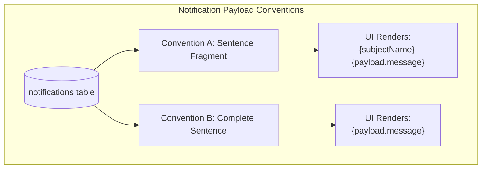
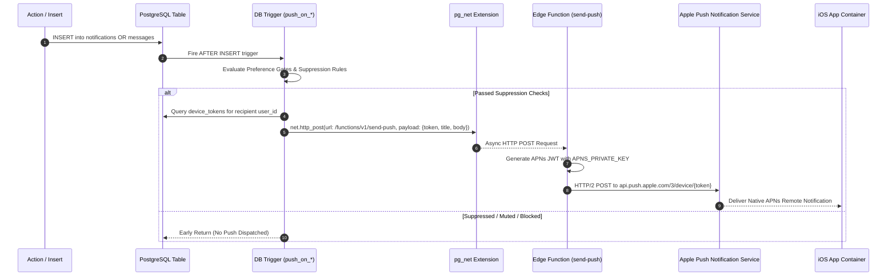

# Notification Engine & Push Pipeline Specification — Third Space

Technical reference covering all notification types, payload schema conventions, UI rendering logic, and the end-to-end push notification pipeline.

---

## 1. Notification Types & Payload Conventions

Third Space enforces two distinct payload conventions across its 11 notification types.

### Payload Schema Matrix

| Notification Type String | Payload Convention | Enqueued By | Exact Payload Shape | UI Render Logic in `Notifications.jsx` |
| --- | --- | --- | --- | --- |
| `connection_request` | **Convention A** | `notify_on_connection_request` trigger | `{ message: "sent you a connection request", sender_id: uuid, name: text }` | Renders bold `notif.user.name` + sentence fragment. Action buttons: **Accept** / **Decline**. |
| `connection_accepted` | **Convention A** | `materialize_connection_on_accept` trigger | `{ message: "accepted your connection request", user_id: uuid, name: text }` | Renders bold `notif.user.name` + sentence fragment. Action button: **Send DM**. |
| `reconnect_nudge` | Special / **Convention A** | `emit_reconnect_nudges` RPC (m08, m27) | `{ message: "Haven't hung out in 30 days", user_id: uuid, name: text }` | Renders bold `"Catch up with {firstName}"` header + subtext. Action buttons: **Send DM** / quick reply composer. |
| `circle_activity` | **Convention A** | `notify_on_circle_message` trigger | `{ message: "posted in General", user_id: uuid, name: text, circle_id: uuid }` | Renders bold `notif.user.name` + sentence fragment. Action button: **Reply to Activity**. |
| `application_approved` | **Convention A** | `notify_on_application_review` trigger | `{ message: "approved your application", circle_id: uuid, circle_name: text }` | Renders bold `notif.circle.name` + sentence fragment. Action button: **View Circle**. |
| `application_declined` | **Convention A** | `notify_on_application_review` trigger | `{ message: "declined your application", circle_id: uuid, circle_name: text }` | Renders bold `notif.circle.name` + sentence fragment. |
| `event_approaching` | **Convention A** | `emit_event_reminders` RPC (m08) | `{ message: "starts in 1 hour!", event_id: uuid, event_title: text }` | Renders bold `notif.event.title` + sentence fragment. Action buttons: **I'm Here** (attendance check-in) / **Can't Make It**. |
| `question_revealed` | **Convention A** | `sync_question_reveals` RPC (m47) | `{ message: "answered the daily icebreaker", name: text, chatId: uuid }` | Renders bold `notif.name` + sentence fragment. Action button: **View Answers**. |
| `spontaneous_question` | **Convention A** | `ask_spontaneous_question` RPC (m47) | `{ message: "asked you a spontaneous question", name: text, chatId: uuid }` | Renders bold `notif.name` + sentence fragment. Action button: **Answer Prompt**. |
| `spontaneous_question_answered` | **Convention A** | `answer_spontaneous_question` RPC (m47) | `{ message: "answered your spontaneous question", name: text, chatId: uuid }` | Renders bold `notif.name` + sentence fragment. Action button: **View Chat**. |
| `lfg_post` | **Convention B** | `create_lfg_post` RPC (m52, m57) | `{ message: "Alice posted an LFG: Tennis at 5 PM", post_id: uuid }` | Renders complete pre-formatted `{notif.message}` string directly. Action button: **Join Activity**. |
| `lfg_join` | **Convention B** | `join_lfg_post` RPC (m53) | `{ message: "Bob joined your LFG: Tennis at 5 PM", post_id: uuid }` | Renders complete pre-formatted `{notif.message}` string directly. Action button: **View LFG**. |
| `poll_created` | **Convention B** | `create_chat_poll` RPC (m38, m56) | `{ message: "Charlie started a poll in Hiking Circle: Next trail?", poll_id: uuid, chatId: uuid }` | Renders complete pre-formatted `{notif.message}` string directly. Action button: **Vote in Poll**. |
| `event_recap` | **Convention B** | `src/lib/eventRecap.js` | `{ message: "How was Sunset Hike? Upload photos!", event_id: uuid }` | Renders complete pre-formatted `{notif.message}` string directly. Action button: **Add Recap Photo**. |

---

## 2. End-to-End Push Delivery Architecture

Push notifications are dispatched asynchronously via PostgreSQL database triggers invoking the `send-push` Edge Function over HTTP/2 using Supabase's `pg_net` extension.

---

## 3. Push Suppression Rules & Preference Gates

Before `send-push` is invoked, the database triggers evaluate 5 strict suppression filters:

1. **Self-Action Suppression**:
   - `push_on_message` and `push_on_notification` compare `auth.uid()` against `recipient_id`. Users NEVER receive push notifications for actions they performed themselves.
2. **Device Token Verification**:
   - The trigger joins `device_tokens` on `user_id`. If no active APNs device token exists for the recipient, execution halts immediately.
3. **Notification Category Preference Gate**:
   - `enqueue_notification()` evaluates the recipient's `intents` array in `profiles.intents` and `question_prefs`. If `notify_events` or `notify_connections` is false, notification generation is aborted.
4. **Trust & Safety Block Gate**:
   - `enqueue_notification()` queries the `blocks` table (`is_blocked_with(sender_id, recipient_id)`). If either user has blocked the other, all notification and push generation is silently suppressed.
5. **Chat Mute / Hidden Thread Gate**:
   - `push_on_message` inspects `chat_members.hidden_at` for the target thread. If the user has hidden/muted the chat thread, message push notifications are suppressed.
